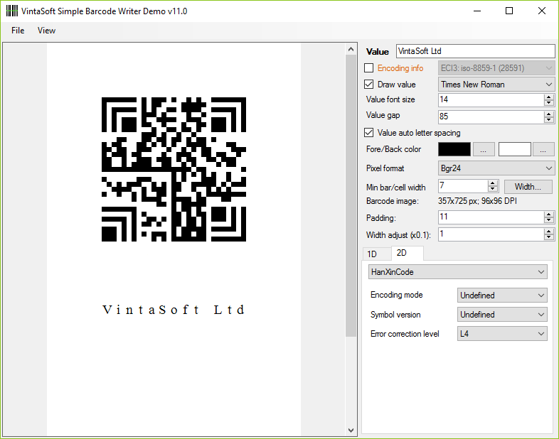

<h1>VintaSoft WinForms Simple Barcode Writer Demo</h1>

Demo application shows how to write barcodes to images. Demo uses functionality of <a href="https://www.vintasoft.com/vsbarcode-dotnet-index.html">VintaSoft Barcode .NET SDK</a>. Source codes for C# and VB.NET are available.

<h2>Screenshot</h2>

<h2>Download</h2>
VintaSoft Barcode .NET SDK distributive package can be downloaded here: https://www.vintasoft.com/download.html

<h2>Documentation</h2>
VintaSoft Barcode .NET SDK on-line User Guide and API Reference for .NET development is available here: https://www.vintasoft.com/docs/vsbarcode-dotnet/

<h2>Support</h2>
Please visit our <a href="https://www.vintasoft.com/support/">online support center</a> if you have any question or problem.
